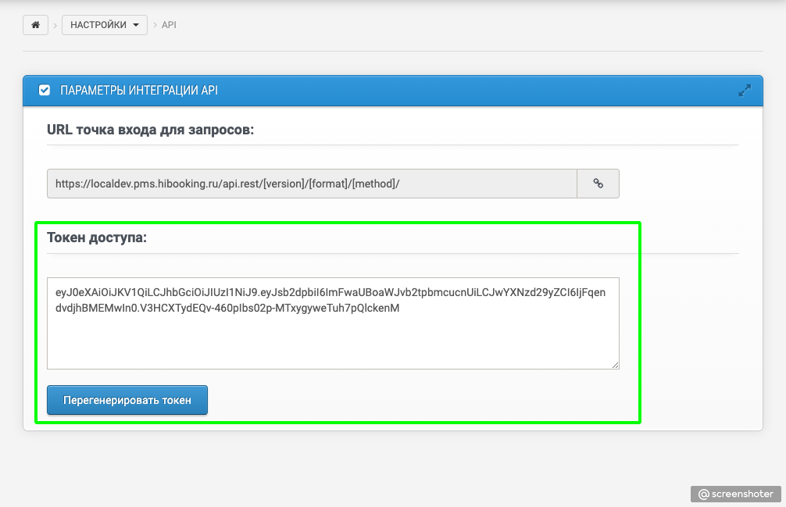

# Авторизация

Для получения токена доступа нужно перейти в раздел PMS `Настройки -> API` и сгенерировать токен

Стандартный способ передачи Access Token в API — через заголовок (Header parameters) в формате:

`Authorization: Bearer <token>`

