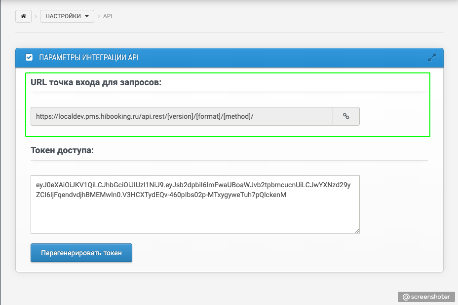

# Получение точки доступа URL API

Для получения точки доступа API нужно перейти в раздел PMS `Настройки -> API` и скопировать шаблон пути

`https://<client_code>.hibooking.ru/api.rest/[version]/[format]/[method]/`

* `client_code` - подставится символьный код клиента
* `version` - версия API (текущая `v1`)
* `format` - формат ответа `json` или `xml`
* `method` - вызываемый метод

